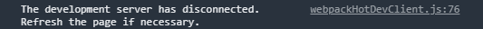
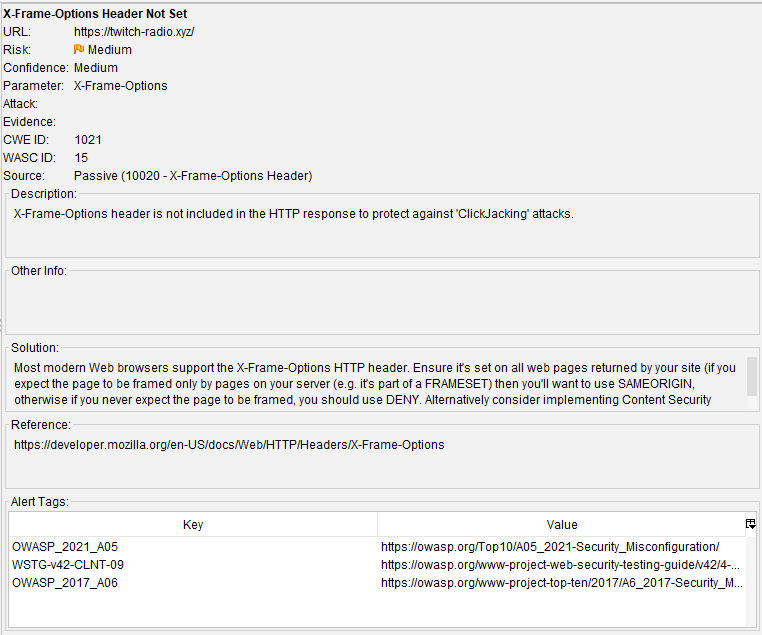

# Feedback
*by CallbackCats*

- [Testen](#Testen)
  - [Acceptance criteria](#Acceptance-criteria)
  - [Evaluatiecriteria ivm beveiliging tegen typische web vulnerabilities](#Evaluatiecriteria-ivm-beveiliging-tegen-typische-web-vulnerabilities)
  - [Evaluatiecriteria ivm HTTPS](#Evaluatiecriteria-ivm-HTTPS)
  - [Permissions & rights](#Permissions-en-rights)
  - [Evaluatiecriteria ivm REST APIs](#Evaluatiecriteria-ivm-REST-APIs)
  - [Evaluatiecriteria ivm wachtwoorden](#Evaluatiecriteria-ivm-wachtwoorden)
  - [Evaluatiecriteria ivm aanmelden](#Evaluatiecriteria-ivm-aanmelden)
- [Threat Model](#Threat-model)
- [Images](#images)
  - [OWASP ZAP](#OWASP-ZAP)
  - [Snyk](#Snyk)
  - [NPM audit](#NPM-audit)
  - [Gitleaks](#Gitleaks)

## Gebruikte tools
- Gitleaks
- OWASP ZAP
- Snyk
- NPM audit
- Dependabot
- [HSTS Preload](https://hstspreload.org/)
- [SSL Labs](https://www.ssllabs.com/ssltest/)
- 2GDPR
- Mozilla Observatory
- Web Page Test

| Meaning | Icon |
| :------ | :--: |
| Passed | ✅ |
| Not Passed | ❌ |
| Not Applicable | 🟡 |

  
## Testen
### Acceptance criteria
| Criteria | Notes | Passed |
| :------- | :---- | :----: |
| Als streamer en kijker ben ik verplicht te registreren om gebruik te kunnen maken van deze app |  | ✅ |
| Als streamer en kijker ben ik bij de registratie verplicht om mijn Spotify account te linken aan mijn profiel op deze app |  | ✅ |
| Als streamer en kijker ben ik verplicht in te loggen na registratie |  | ✅ |
| Wanneer ik als kijker mijn twitch link aan mijn profiel op deze app, wordt ik een streamer | Geen manier om Twitch te linken aan account. | ❌ |
| Als streamer en kijker heb ik de mogelijkheid om streamers op te zoeken aan de hand van zijn/haar username van Twitch | Opzoeken lukt niet* | ❌ |
| Als streamer en kijker heb ik de mogelijkheid om het profiel van de gevonden streamer te bekijken | Opzoeken lukt niet* | ❌ |
| Als streamer en kijker heb ik de mogelijkheid om op het profiel van de gevonden streamer het lied waarnaar deze streamer aan het luisteren is af te spelen | Opzoeken lukt niet* | ❌ |

#### Opmerkingen
*Criteria is niet aangevinkt op GitHub en het gebruiken van de zoekbalk geeft altijd een error.

  
### Evaluatiecriteria ivm beveiliging tegen typische web vulnerabilities
| Criteria | Notes | Passed |
| :------- | :-----| :----: |
| geheimen zijn niet publiek beschikbaar |  | ✅ |
| er wordt geen gebruik gemaakt van kwetsbare componenten - geen van de runtime dependencies hebben een High of  Critical Severity CVSS score | Zie bijlage voor oplijsting. | ❌ |
| indien je sessie cookies gebruikt tussen de browser en een server-side toepassing, zorg er dan voor dat | Geen cookies. | 🟡 |
| <li>ze minstens SameSite: Lax zijn om het risico op CSRF te beperken</li> |  | 🟡 |
| <li>alle formulieren een CSRF token bevatten dat server-side gecontroleerd wordt</li> |  | 🟡 |
| <li>de sessie afloopt na verloop van tijd</li> |  | 🟡 |
| indien je cookies gebruikt om het access token te transporteren tussen een SPA en de REST API (kan enkel  indien OP, static web server en API dezelfde publieke suffix gebruiken), zorg er dan voor dat| Geen cookies. | 🟡 |
| <li>ze SameSite: Strict zijn om CSRF te vermijden</li> |  | 🟡 |
| <li>enkel over een geëncrypteeerd connectie kunnen worden verstuurd (Secure vlag)</li> |  | 🟡 |
| maak zo veel mogelijk gebruik van escaping en output encoding van een templating engine om XSS te vermijden |  | ✅ |
| indien escaping van niet-vertrouwde data onmogelijk is, zorg dan voor sanitization om XSS te vermijden |  | ✅ |
| definieer een strikte CSP voor je toepassing - een goede CSP draagt bij tot het bestrijden van XSS en andere  injection aanvallen (HTML, CSS, ....), alsmede clickjacking| Geen CSP. | ❌ |
| <li>laat geen unsafe-inline toe. Inline scripts of styles worden best vermeden, maar indien toch nodig, dienen ze  voorzien te worden van een hash of nonce </li>|  | ❌ |
| <li>laat geen unsafe-eval toe</li> |  | ❌ |
| zet de X-Frame-Options header om clickjacking te vermijden of vermijd het met frame-ancestors in je CSP | Geen header. | ❌ |
| voor actieve resources van derden wordt SubResource Integrity (SRI) gebruikt |  | ✅ |
| laad geen overbodige code, dit vergroot enkel de 'attack surface' van je toepassing |  | ✅ |
| X-Content-Type-Options: nosniff wordt gebruikt om MIME sniffing tegen te gaan.  | Header is niet aanwezig. | ❌ |

#### Opmerkingen
- Npm audit gebruiken en alle dependencies updaten zodat er een kleinere kans is op vulnerabilities.
- Headers moeten goed bekeken worden aangezien dit een simpele manier is voor verbeterde security. (CSP is heel belangrijk!)
- Client ID bij Spotify login is altijd hetzelfde => kan dit een probleem vormen?

  
### Evaluatiecriteria ivm HTTPS
| Criteria | Notes | Passed |
| :------- | :-----| :----: |
| alle publiek bereikbare onderdelen van je web toepassing mogen enkel over HTTPS beschikbaar zijn. Dit behelst dus niet enkel web pagina's en ondersteunend materiaal zoals CSS of JavaScript bestanden, maar ook publieke APIs. Deze vereiste is zo belangrijk voor de veiligheid dat oplossingen die hier niet aan voldoen een nul-score krijgen voor de demo opdrachten | Website en API OK | ✅ |
| server X.509 certificaten vormen deel van een certificate chain waarvan de root voorkomt in de standaard trust store van mainstream browsers, zoals Firefox, Chrome of Safari, of beheerssystemen, zoals Windows, macOS of Linux |  | ✅ |
| je domein of domeinen krijgen minstens een A score bij de SSL Labs server test | A+ | ✅ |
| iedere respons bevat een Strict-Transport-Security header |  | ✅ |
| je domein of domeinen staan in de HSTS preload list of wachten op toevoeging | Pending submission. | ✅ |
| er zijn CAA DNS Resource Records voor je domein of domeinen.  | Geen CAA records. | ❌ |

#### Opmerkingen
- Tweede certificaat dat niet vertrouwd wordt => Mogelijk om dit te verwijderen?
- Http stuurt HSTS header => Dit heeft geen effect bij HTTP, aanbevolen om deze niet te sturen bij HTTP
- Er missen verschillende headers in de requests => Aanbevolen om deze eens na te kijken voor verbeterde veiligheid

  
### Permissions en rights
| Criteria | Notes | Passed |
| :------- | :-----| :----: |
| Iedere pagina van de webtoepassing bevat een duidelijk zichtbare link naar de privacyverklaring die de gebruiker informeert over persoonsgegevensverwerking. | Geen link. | ❌ |
| De applicatie zal conform zijn met de GDPR regels & de ePrivacy richtlijn |  | ❌ |

#### Opmerkingen
- Er is onderaan op de pagina plaats om een link te plaatsen voor informatie rond de privacyverklaring. (Er bestaan sites die dit kunnen genereren. Bv. [VeiligInternetten](https://veiliginternetten.nl/privacyverklaring-generator/generate/))
- Op dit moment kunnen er geen gegevens van de gebruiker gedownload worden/opgevraagd worden.

  
### Evaluatiecriteria ivm REST APIs
| Criteria | Notes | Passed |
| :------- | :-----| :----: |
| de API situeert zich minstens op niveau 2 van het Richardson Maturity Model. Dit houdt in dat elke resource wordt gerepresenteerd door een eigen URL en de gepaste HTTP verbs worden gebruikt voor CRUD operaties. Hierbij zijn |  |  |
| <li>GET en OPTIONS safe en idempotent; </li>|  | ✅ |
| <li>PUT en DELETE niet safe, maar wel idempotent;  </li>|  | ✅ |
| <li>POST en PATCH noch safe noch idempotent;  </li>|  | ✅ |
| API URLs zijn als volgt gestructureerd: |
| <li>voor een collectie: \<API URL>/:collectie_id;  </li>|  | ✅ |
| <li>voor een element in een collectie: \<API URL>/:collectie_id/:element_id; </li>|  | ✅ |
| het application/json media type wordt steeds ondersteund, zowel voor request als response bodies. De API mag ook andere media types aanvaarden, zoals bv. application/x-www-form-urlencoded, maar dat hoeft niet; |  | ✅ |
| succesvolle requests worden beantwoord met status codes 200, 201 (in geval van een POST), of 204 (in geval er geen respons body is); |  | ✅ |
| un-safe requests die niet succesvol zijn, hebben geen effect. Er wordt bijvoorbeeld geen element toegevoegd als een POST request resulteert in status code 400; | | ✅ |
| indien vereiste request parameters ontbreken of request parameters geweigerd worden op basis van input validatie, dan wordt er een status code 400 of 406 terug gestuurd; |  | ✅ |
| een request die authenticatie vereist, maar geen access token bevat, geeft aanleiding tot status code 401; |  | ✅ |
| een request met een access token zonder de nodige permissies wordt beantwoord met status code 403; | Op dit moment zijn er geen pagina's die dit moeten opleveren. | ✅ |
| GET, PUT, en OPTIONS requests op niet-bestaande resources resulteren in status code 404; |  | ✅ |
| methoden opgeroepen op resources die de methode niet ondersteunen geven aanleiding tot status code 405; | Deze leveren status code 404 op. | ❌ |
| indien de Accept request header een niet ondersteund media type bevat, dan resulteert een request in status code 406; | Geeft status code 502 Bad Gateway terug. | ❌ |
responses met een body bevatten zowel een correcte Content-Type header als X-Content-Type-Options: nosniff om MIME sniffing tegen te gaan; | Dit gebeurd niet. | ❌ |
een collectie ondersteunt de methodes PUT, PATCH en DELETE niet. Ze worden dus beantwoord met status code 405; | Deze leveren status code 404 op. | ❌ |
| POST wordt nooit ondersteund op een element. | POST kan gebruikt worden op de auth routes. | ❌ |

Opmerkingen
- In de code van de API staat er vaak een catch methode, maar deze stuurt een algemene status code (400) terug. Deze zou meer specifiek bepaald kunnen worden op basis van de error/case.

  
### Evaluatiecriteria ivm wachtwoorden
Het registratie- en aanmeldproces wordt niet geregeld door de applicatie. Deze verloopt langs Spotify/Twitch respectievelijk.

  
### Evaluatiecriteria ivm aanmelden
| Criteria | Notes | Passed |
| :------- | :-----| :----: |
| een gebruiker moet zich ook kunnen afmelden; |  | ✅ |
| de applicatie geeft ten alle tijde duidelijk aan of de gebruiker al dan niet aangemeld is; | Bij klikken op Logout button wordt er enkel doorverwezen naar de home pagina. Bij terug op login te klikken wordt er automatisch ingelogd. | ❌ |
| na aanmelden kan de gebruiker zijn of haar gegevens opvragen. | De gegevens die de applicatie bijhoudt kunnen niet bekeken/opgevraagd worden. | ❌ |

#### Opmerkingen
- De logout knop verstuurd de gebruiker enkel terug naar de homepagina. 

  
## Threat Model
| Threat | Solution | Notes | Passed |
| :----- | :------- | :---- | :----: |
| Spoofing | Auth0 | Login/registreren wordt afgehandelt door Spotify. | ✅ |
| Tampering | JWT-tokens |  | ✅ |
| Repudiation | Logging | Er zijn geen logs beschikbaar in de applicatie. | ❌ |
| Information Disclosure | Encryption | | ✅ |
| Denial of Service | Kubernetes |  | ✅ |
| Elevation of Service | Roles | | ✅ |

  
## Aanbevelingen
- Om de gegevens van de gebruiker te tonen kan er een Spotify Endpoint gebruikt worden. [meer info](https://developer.spotify.com/documentation/web-api/quick-start/)
- Om de gebruiker van Spotify uit te loggen kan er verwezen worden naar "https://accounts.spotify.com/en/logout" + de gegevens uit LocalStorage verwijderen
- De error van search kan mogelijk opgelost worden door enkel te checken dat "this.state.user.profileImageUrl" is ipv te controleren dat dit niet undefined is.
- Er staan nog verschillende gegevens in de console (waarschijnlijk voor te testen), deze worden best verwijdert voor een productie omgeving.
- De app wordt gestart als "development", mogelijks wordt er geen build uitgevoerd op de server.
- Geef elementen van een lijst elk een key attribute in ProfileTemplate.js

  
## Images (zie [folder](feedback/images) voor meer)
### OWASP ZAP

### Snyk

### [NPM audit](feedback/npm_audit_web.txt)
Enkel web had vulnerabilities / API had geen.

### Gitleaks

### Mozilla Observatory
